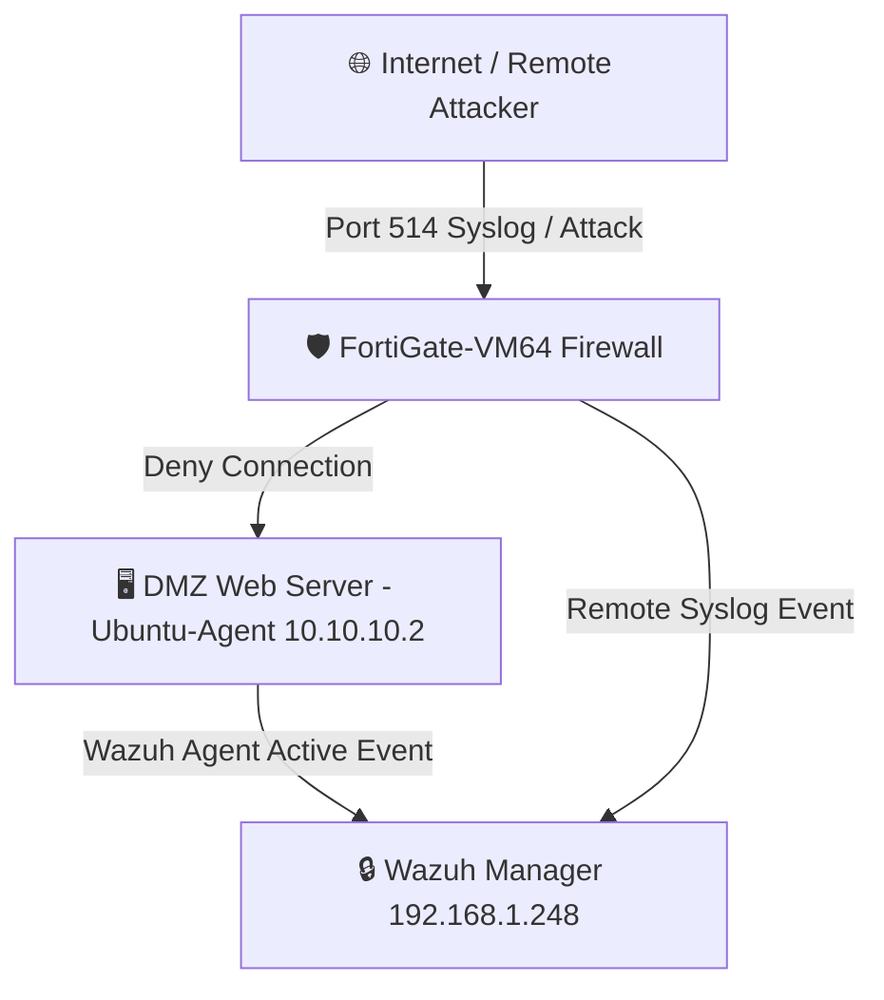

# SKILL: REAL NETWORK TOPOLOGY VISUALIZATION

## NGUYÊN TẮC VẼ SƠ ĐỒ MẠNG THẬT
- **Zero Hallucination**: Chỉ vẽ các thiết bị có thật trong kết quả API `GET /agents` của Wazuh Manager hoặc trong mảng alert Syslog thực tế.
- **Phân loại Node**:
  1. `[Wazuh Manager]` (192.168.1.248) - SIEM Central Core Node.
  2. `[Endpoint Agent]` (10.10.10.2 - Ubuntu-Agent) - Active Host Agent Node.
  3. `[Syslog Gateway]` (FortiGate Firewall) - Network Integration Node.

## ĐỊNH DẠNG SƠ ĐỒ MERMAID CHUẨN

